# zj-theme.nvim — Architecture

This document explains how zj-theme.nvim is put together, for anyone
modifying or extending it. It follows the plugin's actual runtime flow —
load, setup, steady-state syncing, and teardown.

For *user-facing* behavior and configuration, see [README.md](README.md).
This document is about the *internals*.

## 1. What the plugin does

Whenever neovim's colorscheme changes, zj-theme.nvim pushes matching colors
into two different places in the surrounding zellij session, using two
independent mechanisms.

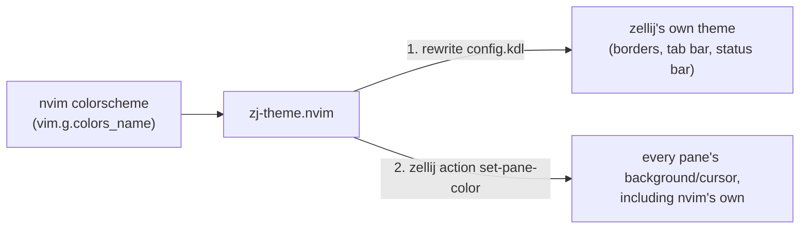

These two channels are deliberately independent: each has its own
enable/disable logic, its own failure mode, and its own fallback. A
failure in one (e.g. `config.kdl` isn't writable) does not block the
other.

## 2. Module map

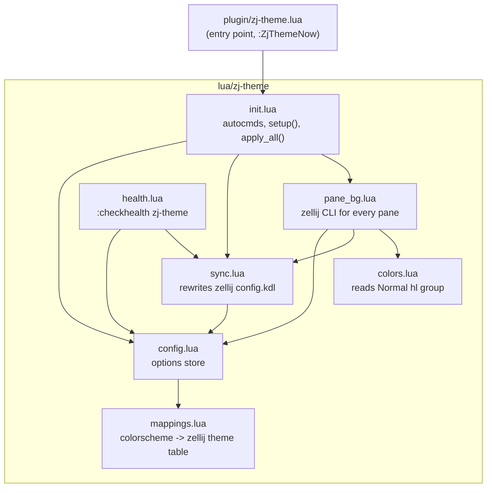

Dependency direction is strict and one-way: `config.lua`, `mappings.lua`,
and `colors.lua` have no dependencies on anything else in the plugin —
`colors.lua` only calls `vim.api.nvim_get_hl`. `sync.lua` depends only on
`config.lua`. `pane_bg.lua` sits on top of both `sync.lua` and
`colors.lua`. `init.lua` wires everything together via autocmds, and
`health.lua` inspects state without mutating it.

| File | Responsibility |
|---|---|
| `plugin/zj-theme.lua` | Load guard + `:ZjThemeNow` user command. The only file loaded automatically by neovim. |
| `lua/zj-theme/init.lua` | Public API (`setup`, `sync_now`); registers all autocmds; defines `apply_all()`, the fan-out to the two sync channels. |
| `lua/zj-theme/config.lua` | Holds `M.options` (merged defaults + user opts) and `M.did_setup`. Pure state, no logic beyond merging. |
| `lua/zj-theme/mappings.lua` | Static table: nvim `colors_name` → zellij theme name (or `{dark=..., light=...}`). |
| `lua/zj-theme/colors.lua` | One function: reads the `Normal` highlight group's bg/fg as `#rrggbb`. Single source of truth for "what color is nvim right now," used by `pane_bg.lua`. |
| `lua/zj-theme/sync.lua` | Channel 1: resolves a colorscheme to a zellij theme name and rewrites the `theme "..."` line in `config.kdl`. |
| `lua/zj-theme/pane_bg.lua` | Channel 2: colors *every* pane — including the one nvim runs in — via `zellij action set-pane-color`. Colors set this way are a zellij-held property of the pane, not tied to nvim's process, so they survive nvim exiting. Owns the action queue and the poll timer. |
| `lua/zj-theme/health.lua` | Read-only `:checkhealth` report; reuses `sync.lua`'s inspection helpers. |

## 3. Startup and event flow

`init.lua` is where everything is orchestrated. `M.setup()` does config
merging, then registers one augroup (`ZjTheme`) with four autocmds.

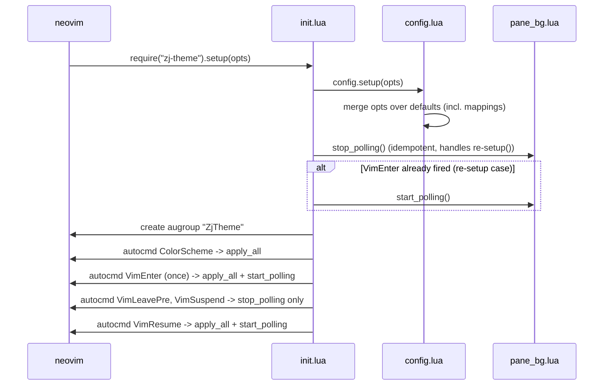

The `stop_polling()`/`start_polling()` dance at the top of `setup()` exists
because `VimEnter` is `once = true` — if the user's config calls `setup()`
twice (or reloads config), that autocmd won't fire again to pick up a
changed `pane_poll_interval_ms`, so `setup()` reconciles the timer itself.

### Full lifecycle across a neovim session

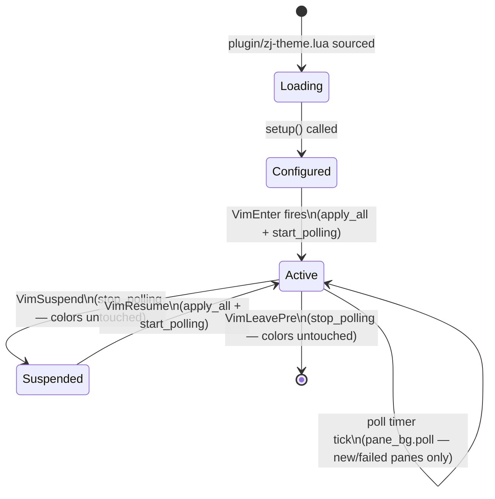

Notably, **nothing resets pane colors on suspend or exit** — that's a
deliberate behavior change from an earlier version of this plugin. Panes
(including nvim's own) keep the last-applied colorscheme's colors
indefinitely, because `set-pane-color` (channel 2) sets a property zellij
holds for the pane itself, not something tied to nvim's process. The goal
is a zellij session that keeps *looking like* the last active colorscheme
everywhere, whether or not nvim is still running in one of its panes —
only the next `ColorScheme` event (or nvim starting again) repaints
anything. `VimLeavePre`/`VimSuspend` only stop the poll timer, since nvim
isn't around to discover new panes anymore.

## 4. Steady state: `apply_all()`

Every `ColorScheme`, `VimEnter`, and `VimResume` autocmd calls the same
two-line function:

```lua
local function apply_all()
  sync.apply(vim.g.colors_name)
  pane_bg.apply()
end
```

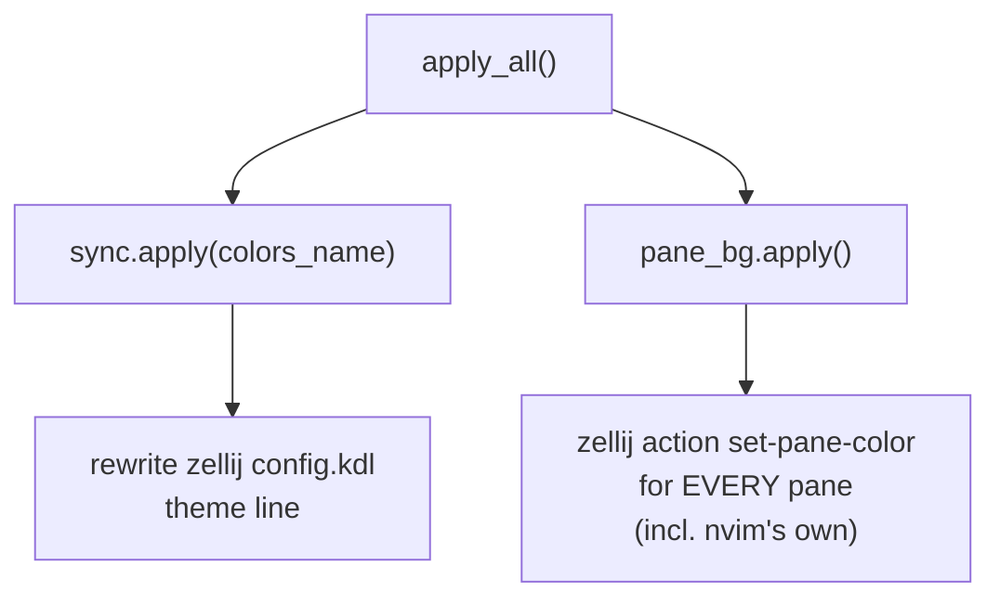

`sync.apply` and `pane_bg.apply` each independently check whether they
should do anything at all (in a zellij session? feature enabled?) and
independently no-op if not — there's no shared gate.

## 5. Channel 1: `sync.lua` — zellij's own theme

`sync.apply(colors_name)` resolves a zellij theme name and writes it into
`config.kdl`. zellij itself polls that file roughly once a second and
applies changes live, so no restart or explicit reload is needed.


`default_theme()` picks `default_dark_theme` or `default_light_theme` based
on `vim.o.background` — so an unmapped dark colorscheme falls back to a
dark zellij theme, never a jarring light one.

`resolve_theme()` also handles the `{dark=..., light=...}` mapping shape,
for colorscheme plugins (e.g. `neovim-ayu`) that keep `colors_name`
constant across their light/dark variants:

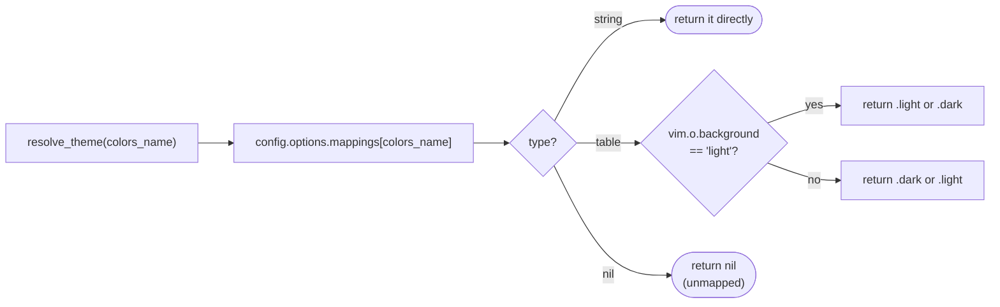

`notify_once` (keyed per-failure-reason, e.g. `"unmapped:catppuccin"`,
`"no_config_file"`) prevents the same warning from spamming on every
`ColorScheme` event; the keys are cleared once the underlying problem is
fixed (a successful write clears the write/config-file warnings).

## 6. Channel 2: `pane_bg.lua` — every pane, persistently

This is the most involved module, because it has to talk to the `zellij`
CLI asynchronously, track which panes have already been colored (and
retry the ones that failed), and avoid hammering the zellij server with
concurrent client connections.

This channel colors **every** pane in the session, including the one nvim
itself is running in. `set-pane-color` is a property zellij holds for the
pane, not something tied to nvim's process — so this is the mechanism that
makes a pane's color actually stick around, including after nvim exits.

### 6.1 The action queue

Every `zellij action ...` invocation is a short-lived client process. Firing
several concurrently (e.g. coloring five sibling panes from one `apply()`
call) can race zellij's server-side tab-sync bookkeeping. So all
`zellij action` calls — from `apply()` and `poll()` alike — go through a
single FIFO queue, run one at a time via `vim.system`.

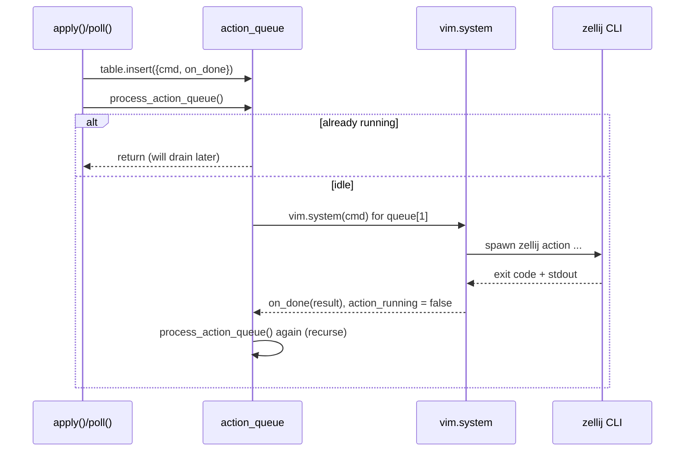

### 6.2 `apply()` vs `poll()`, and the success-gated retry

Both share `list_pane_ids()`, which runs `zellij action list-panes --json`
and filters out only plugin panes and exited panes — the current pane
(`$ZELLIJ_PANE_ID`) is no longer excluded, since this channel now colors
it too.

A pane only lands in `known_ids` once its `set_pane_color` call actually
**succeeds** (`result.code == 0`) — not just once it's been attempted.
That's what makes a transient failure (e.g. a momentary CLI hiccup)
self-healing: the pane simply isn't marked known, so the next `poll()`
tick tries it again instead of the plugin silently giving up on it until
the next colorscheme switch.

`pending_ids` exists so `poll()` doesn't double-dispatch to a pane whose
first attempt is still queued/in-flight — without it, a slow-draining
action queue could see the same not-yet-known pane on two consecutive
poll ticks and queue two redundant `set-pane-color` calls for it.

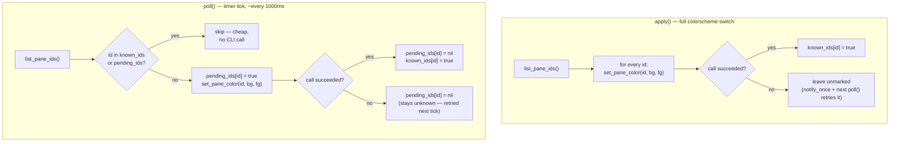

`known_ids` (once populated) is the reason `poll()` is cheap when nothing
has changed: it's one `list-panes` call and zero `set-pane-color` calls
unless a genuinely new — or still-failing — pane id shows up. This is what
lets polling run on a 1-second timer without noticeable overhead.

There is no `reset()` anymore (see §3): pane colors are never explicitly
put back to zellij's defaults. They simply stay as last painted until the
next `ColorScheme` event.

### 6.3 Poll timer lifecycle

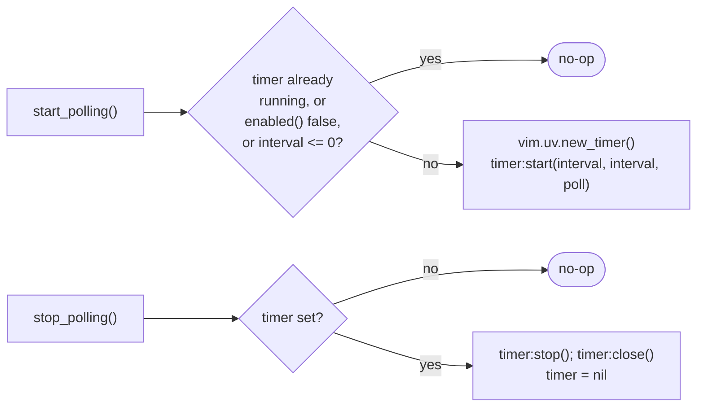

Called from `init.lua` at: `setup()` (reconciliation), `VimEnter` (start),
`VimLeavePre`/`VimSuspend` (stop), `VimResume` (start again).

## 7. Shared building blocks

### `colors.lua`

One function, `hl_colors()`, reads `vim.api.nvim_get_hl(0, {name="Normal"})`
and formats `bg`/`fg` as `#rrggbb`. `pane_bg.lua` calls this for every pane
it colors, including nvim's own — it's the single source of truth for
"what color should panes be right now."

### `config.lua`

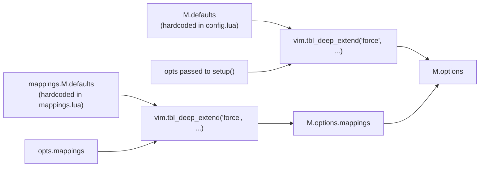

`M.options` is always populated, even without calling `setup()` — plain
`require("zj-theme.config").options` works out of the box with defaults.
`M.did_setup` is a separate flag purely so `:checkhealth` can distinguish
"never configured" from "configured with all-default values."

## 8. Health check (`health.lua`)

`:checkhealth zj-theme` is a read-only walk through the same checks
`sync.apply()`/`pane_bg.apply()` make internally, surfaced for
diagnostics. It reuses `sync.config_file_status()` and `sync.resolve_theme()`
directly rather than duplicating that logic.

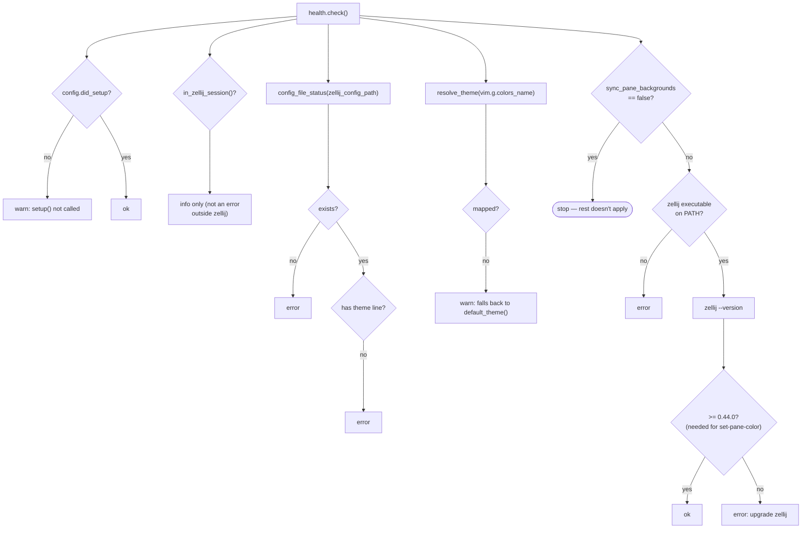

`M.parse_zellij_version()` and `M.zellij_version_at_least()` are exposed
specifically so tests can exercise the version-comparison logic without
shelling out to a real `zellij` binary.

## 9. External surfaces this plugin touches

| Surface | Module | Direction | Notes |
|---|---|---|---|
| `$ZELLIJ` env var | `sync.lua` (`in_zellij_session`) | read | Presence gates every channel. |
| `$ZELLIJ_PANE_ID` env var | — | read | No longer used to exclude the current pane — `pane_bg.lua` now colors every pane, including this one. Kept around implicitly in env only; not read by `list_pane_ids()` anymore. |
| `zellij_config_path` (`config.kdl`) | `sync.lua` | read + write | In-place rewrite of one line; zellij's own ~1s file watch picks it up. |
| `zellij` CLI (`list-panes`, `set-pane-color`, `--version`) | `pane_bg.lua`, `health.lua` | subprocess (`vim.system`) | Requires zellij ≥ 0.44.0 for `set-pane-color`. |
| `Normal` highlight group | `colors.lua` | read | Via `vim.api.nvim_get_hl`. |
| `vim.notify` | `sync.lua`, `pane_bg.lua`, `health.lua` | write | Deduplicated via `notify_once`/`warned` tables, disable-able via `notify = false`. |

## 10. Testing

Tests live in `tests/zj-theme/*_spec.lua`, one file per module (mirrors the
module list in §2), run via `tests/minimal_init.lua`. Notable seams built
specifically for testability:

- `pane_bg.M.reset_warnings()` / `sync.M.reset_warnings()` clear the
  module-level `warned`/`known_ids`/`pending_ids`/queue state between test
  cases.
- `sync.M.parse_zellij_version()` / `M.zellij_version_at_least()` are
  exposed standalone so version-comparison logic doesn't require mocking
  `vim.system`.
- `vim.system` calls (in `pane_bg.lua` and `sync.lua`'s health check) are
  stubbed at the `vim.system` boundary rather than requiring a real
  `zellij` binary in CI.

## 11. Where to make common changes

- **New colorscheme mapping**: `lua/zj-theme/mappings.lua`, `M.defaults`.
- **New/changed autocmd or lifecycle hook**: `lua/zj-theme/init.lua`.
- **Changing how zellij's own theme is chosen/written**: `sync.lua`
  (`resolve_theme`, `write_theme`).
- **Changing what color gets pushed into panes**: `colors.lua`
  (`hl_colors`) — `pane_bg.lua` reads from here.
- **Pane coloring (any pane, including nvim's own), pane discovery, retry
  behavior, or polling cadence**: `pane_bg.lua`.
- **Bringing back a "reset colors on exit" behavior**: was removed
  deliberately (see §3, §6) — check `git log` on `pane_bg.lua`/`init.lua`
  for the rationale before reintroducing it, since it was a reported
  regression from an earlier version, not an oversight.
- **New `:checkhealth` check**: `health.lua`, ideally reusing an existing
  `sync.lua` inspection helper rather than duplicating logic.
