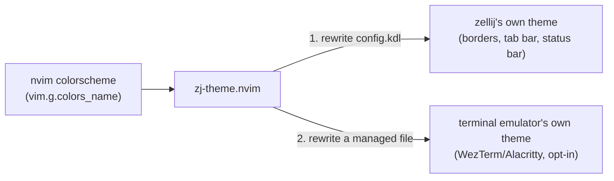
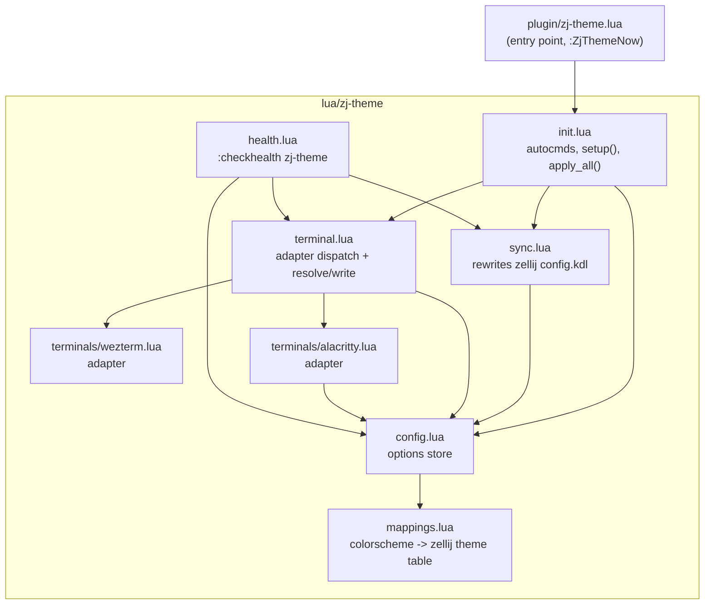
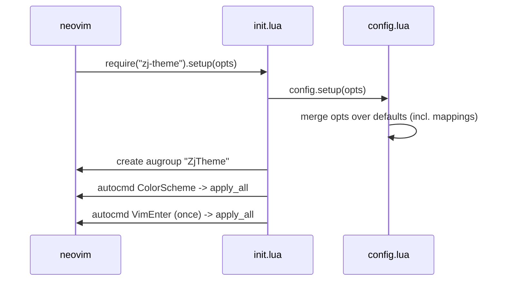
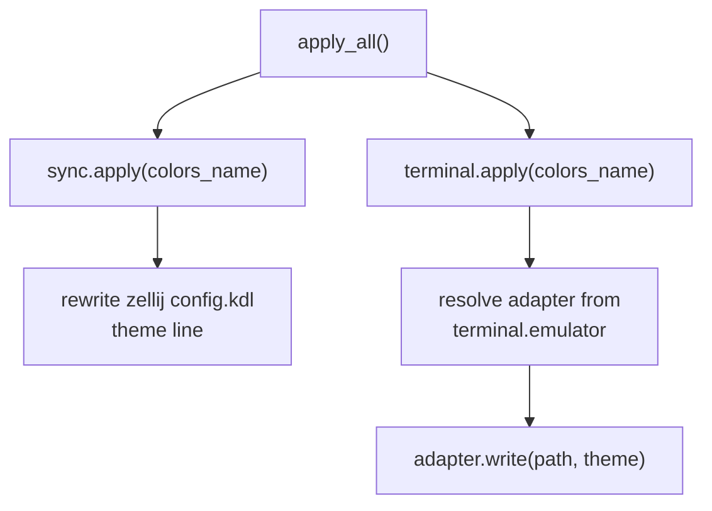
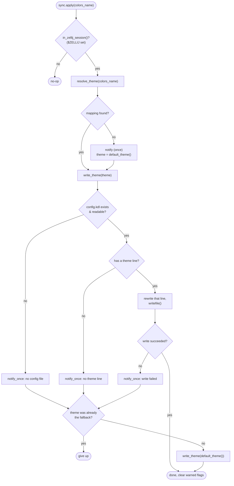
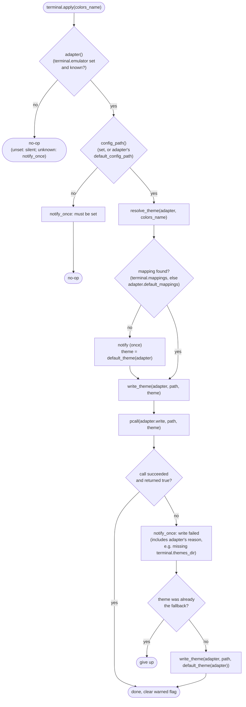
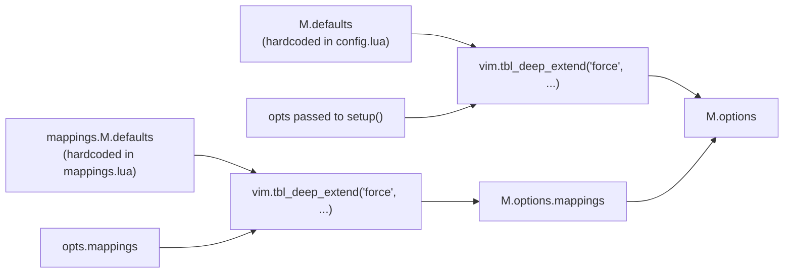
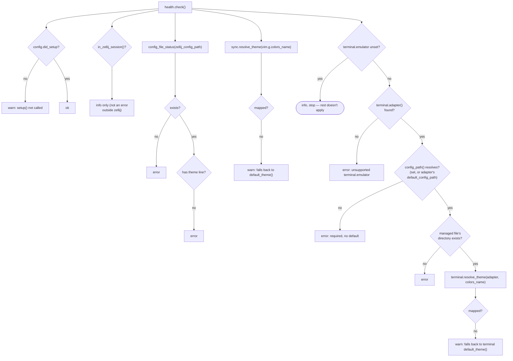

# zj-theme.nvim — Architecture

This document explains how zj-theme.nvim is put together, for anyone
modifying or extending it. It follows the plugin's actual runtime flow —
load, setup, steady-state syncing.

For *user-facing* behavior and configuration, see [README.md](README.md).
This document is about the *internals*.

## 1. What the plugin does

Whenever neovim's colorscheme changes, zj-theme.nvim pushes matching colors
into two independent places, via two independent channels:



These two channels are deliberately independent: each has its own
enable/disable logic, its own failure mode, and its own fallback. A
failure in one (e.g. `config.kdl` isn't writable) does not block the
other. Channel 1 requires a zellij session; channel 2 does not — it works
in a plain terminal too.

## 2. Module map



Dependency direction is strict and one-way: `config.lua` and `mappings.lua`
have no dependencies on anything else in the plugin. `sync.lua` depends
only on `config.lua`. `terminal.lua` depends on `config.lua` and its
adapter modules. Adapters are otherwise leaves (pure data + one `write()`
function) — `wezterm.lua` has no further dependency, but `alacritty.lua`
is the one exception: its `write()` reads `terminal.themes_dir` straight
off `config.lua`, since that option is specific to this adapter and has no
business being threaded through `terminal.lua`'s shared driver (see §6.1).
`init.lua` wires everything together via autocmds, and `health.lua`
inspects state without mutating it.

| File | Responsibility |
|---|---|
| `plugin/zj-theme.lua` | Load guard + `:ZjThemeNow` user command. The only file loaded automatically by neovim. |
| `lua/zj-theme/init.lua` | Public API (`setup`, `sync_now`); registers the `ColorScheme`/`VimEnter` autocmds; defines `apply_all()`, the fan-out to the two channels. |
| `lua/zj-theme/config.lua` | Holds `M.options` (merged defaults + user opts) and `M.did_setup`. Pure state, no logic beyond merging. |
| `lua/zj-theme/mappings.lua` | Static table: nvim `colors_name` → zellij theme name (or `{dark=..., light=...}`). Used by channel 1 only. |
| `lua/zj-theme/sync.lua` | Channel 1: resolves a colorscheme to a zellij theme name and rewrites the `theme "..."` line in `config.kdl`. |
| `lua/zj-theme/terminal.lua` | Channel 2: picks the adapter named by `terminal.emulator`, resolves a colorscheme via that adapter's mapping table (+ `terminal.mappings` overrides), and calls the adapter's `write()`. |
| `lua/zj-theme/terminals/wezterm.lua` | Adapter: colorscheme → WezTerm bundled scheme name; `write()` overwrites a managed `.lua` file with `return "<name>"`. |
| `lua/zj-theme/terminals/alacritty.lua` | Adapter: colorscheme → a filename in `alacritty/alacritty-theme`'s `themes/`; `write()` overwrites a managed `.toml` file with a `general.import` pointing at it. |
| `lua/zj-theme/health.lua` | Read-only `:checkhealth` report; reuses `sync.lua`'s and `terminal.lua`'s inspection helpers. |

## 3. Startup and event flow

`init.lua` is where everything is orchestrated. `M.setup()` does config
merging, then registers one augroup (`ZjTheme`) with two autocmds — both
just call the same `apply_all()`:



There is no polling and no suspend/resume handling: both channels are a
single synchronous-ish "resolve, write" operation per `ColorScheme` event,
not something with ongoing state that needs to be started/stopped around
nvim suspending.

## 4. Steady state: `apply_all()`

Every `ColorScheme` and `VimEnter` autocmd calls the same two-line
function:

```lua
local function apply_all()
  sync.apply(vim.g.colors_name)
  terminal.apply(vim.g.colors_name)
end
```



`sync.apply` and `terminal.apply` each independently check whether they
should do anything at all (in a zellij session? `terminal.emulator` set?)
and independently no-op if not — there's no shared gate.

## 5. Channel 1: `sync.lua` — zellij's own theme

`sync.apply(colors_name)` resolves a zellij theme name and writes it into
`config.kdl`. zellij itself polls that file roughly once a second and
applies changes live, so no restart or explicit reload is needed.



`default_theme()` picks `default_dark_theme` or `default_light_theme` based
on `vim.o.background` — so an unmapped dark colorscheme falls back to a
dark zellij theme, never a jarring light one.

`resolve_theme()` also handles the `{dark=..., light=...}` mapping shape,
for colorscheme plugins (e.g. `neovim-ayu`) that keep `colors_name`
constant across their light/dark variants:


`notify_once` (keyed per-failure-reason, e.g. `"unmapped:catppuccin"`,
`"no_config_file"`) prevents the same warning from spamming on every
`ColorScheme` event; the keys are cleared once the underlying problem is
fixed (a successful write clears the write/config-file warnings).

## 6. Channel 2: `terminal.lua` — the terminal emulator's own theme

`terminal.apply(colors_name)` is structurally the same shape as
`sync.apply` — resolve a theme name, write it, retry with a fallback on
failure — but the resolution and writing are delegated to whichever
adapter `terminal.emulator` names, and there's no "is a session even
running" gate (a terminal emulator is either there or it isn't; there's no
equivalent of `$ZELLIJ` to check first).



The `pcall` around `adapter.write` exists because — unlike `sync.lua`,
which pre-checks `config.kdl` exists/is readable before ever calling
`vim.fn.writefile` — the managed file this channel writes to has no
equivalent pre-existence check, and `vim.fn.writefile` throws a real Vim
error (not just a `-1` return) when its parent directory doesn't exist.
`adapter.write` may also return a second value — a human-readable reason
for a `false` result — which `write_theme` folds into the notified
message (this is how alacritty's missing-`terminal.themes_dir` case
surfaces a specific message instead of a generic "failed writing").

`terminal.config_path` falls back to the adapter's own
`default_config_path` when unset — each adapter's standard config dir
(e.g. `~/.config/wezterm/zj-theme.lua`), same idea as
`zellij_config_path` defaulting to zellij's own standard path. Explicit
config always wins. If neither is set (an adapter defines no
`default_config_path`), `terminal.apply`/`:checkhealth` error instead of
guessing further.

### 6.1 Adapters (`terminals/*.lua`)

Each adapter is a self-contained leaf module exposing:

| Field | Purpose |
|---|---|
| `default_mappings` | colorscheme → theme name (or `{dark=, light=}`), this adapter's equivalent of `mappings.lua`. |
| `default_dark_theme` / `default_light_theme` | Fallback theme names, this adapter's equivalent of `default_dark_theme`/`default_light_theme`. |
| `default_config_path` | Used by `terminal.config_path(adapter)` when `terminal.config_path` is unset. Optional — an adapter with none makes `config_path` required. |
| `write(path, theme)` | Overwrites `path` with whatever this terminal needs to pick up `theme`. Returns `true`/`false`, optionally followed by a reason string on `false`. |

Most adapters have no other dependency on `config.lua` (`wezterm.lua`
doesn't) — `alacritty.lua` is the exception, since resolving a theme into
an `import` path needs `terminal.themes_dir`, which is specific to this
one adapter and doesn't belong threaded through `terminal.lua`'s shared
`write(path, theme)` signature. It's read directly:
`require("zj-theme.config").options.terminal.themes_dir or
M.default_themes_dir` inside `alacritty.lua`'s own `write()`, returning
`false, "terminal.themes_dir must be set..."` if both are unset. This is
the general pattern for any future adapter that needs config beyond
`terminal.config_path`.

The design principle: **the plugin only ever writes to its own managed
file, never to the user's real terminal config.** The terminal's real
config needs a one-time edit (documented in the README) to import/require
that managed file — this is the same shape as `sync.lua` requiring an
existing `theme "..."` line in `config.kdl` rather than adding one from
scratch. It means a bug in this plugin can, at worst, corrupt its own
single-purpose file, never the user's hand-written terminal config.

- **WezTerm**: the managed file is plain Lua (`return "<scheme name>"`),
  `require()`d from the user's real `wezterm.lua`. Theme names are
  resolved directly against WezTerm's ~700 bundled color schemes — no
  external files needed.
- **Alacritty**: has no built-in named schemes, so theme names are
  resolved as `<terminal.themes_dir>/<theme>.toml` — expected to be a
  checkout of `alacritty/alacritty-theme`'s `themes/` folder. The managed
  file contains a `general.import` pointing at that resolved path;
  Alacritty resolves `import` recursively and live-reloads by default.

### 6.2 Kitty and Ghostty

Kitty's idiomatic live-switch path is `kitty @ set-colors` over a
remote-control socket, not a file watch — a file-based adapter is
possible (drop a themed `.conf`, `include` it, rely on kitty's default
autoreload) but needs its own wiring, not a copy of WezTerm's.

Ghostty has no automatic file-watch config reload — only a manual
keybind, `SIGUSR2`, or (Linux/systemd) `systemctl reload`. An adapter
would need to send that reload signal itself after every write.

### 6.3 Adding a new adapter

To support another terminal emulator, add `lua/zj-theme/terminals/<name>.lua`
implementing the table in §6.1, then register it in the `adapters` table
at the top of `terminal.lua`. It only qualifies if the terminal reloads
its own config live on file change — if it doesn't (§6.2), there's no way
to apply `write()`'s output without an explicit user action, which
defeats the point of this channel.

## 7. `config.lua`



`M.options` is always populated, even without calling `setup()` — plain
`require("zj-theme.config").options` works out of the box with defaults.
`M.did_setup` is a separate flag purely so `:checkhealth` can distinguish
"never configured" from "configured with all-default values."

Note that `terminal.mappings`/`terminal.default_dark_theme`/
`terminal.default_light_theme` are **not** deep-merged with an adapter's
defaults here the way `mappings` is merged with `mappings.lua`'s — which
adapter's defaults would even apply depends on `terminal.emulator`, itself
just another option in the same `opts` table being merged, so `config.lua`
can't know it ahead of time without special-casing terminal options. That
merge happens per-lookup instead, in `terminal.lua`'s `resolve_theme()`/
`default_theme()` (`user value or adapter default value`) — see §6.

## 8. Health check (`health.lua`)

`:checkhealth zj-theme` is a read-only walk through the same checks
`sync.apply()`/`terminal.apply()` make internally, surfaced for
diagnostics. It reuses `sync.lua`'s and `terminal.lua`'s inspection
helpers directly rather than duplicating that logic.



Note `health.lua` does not have an adapter-specific check for
`terminal.themes_dir` (alacritty) — that gap is deliberate, matching §6.1:
adapter-specific requirements surface through `write()`'s own error
reason at apply-time (visible via `:ZjThemeNow` or the next `ColorScheme`
event) rather than every adapter's extra options needing a bespoke health
check wired in here.

## 9. External surfaces this plugin touches

| Surface | Module | Direction | Notes |
|---|---|---|---|
| `$ZELLIJ` env var | `sync.lua` (`in_zellij_session`) | read | Gates channel 1 only. |
| `zellij_config_path` (`config.kdl`) | `sync.lua` | read + write | In-place rewrite of one line; zellij's own ~1s file watch picks it up. |
| `terminal.config_path` (managed file) | `terminal.lua`, `terminals/*.lua` | write only | Fully overwritten each time, never read back. Never the user's real terminal config. Falls back to the adapter's `default_config_path` when unset (§6). |
| `terminal.themes_dir` | `terminals/alacritty.lua` | read (path only, not opened) | Alacritty-only; used to build the `import` path written into the managed file. Read directly off `config.lua`, bypassing `terminal.lua` (§6.1). Falls back to the adapter's `default_themes_dir` when unset. |
| `vim.notify` | `sync.lua`, `terminal.lua`, `health.lua` | write | Deduplicated via `notify_once`/`warned` tables, disable-able via `notify = false`. |

## 10. Testing

Tests live in `tests/zj-theme/*_spec.lua`, one file per module (mirrors the
module list in §2), run via `tests/minimal_init.lua`. Notable seams built
specifically for testability:

- `sync.M.reset_warnings()` / `terminal.M.reset_warnings()` clear the
  module-level `warned` state between test cases.
- Adapters are plain data + a pure `write()` function that only touches
  the filesystem, so adapter tests (`terminal_spec.lua`) just point
  `terminal.config_path` at `vim.fn.tempname()` and read the result back.
  Tests exercising the `default_config_path`/`default_themes_dir`
  fallback stub those fields on the adapter table directly (restored
  after) rather than let them resolve to the adapter's real
  `~/.config/...` default.

## 11. Where to make common changes

- **New zellij colorscheme mapping**: `lua/zj-theme/mappings.lua`,
  `M.defaults`.
- **New terminal colorscheme mapping**: the relevant
  `lua/zj-theme/terminals/*.lua`, `M.default_mappings`.
- **New/changed autocmd or lifecycle hook**: `lua/zj-theme/init.lua`.
- **Changing how zellij's own theme is chosen/written**: `sync.lua`
  (`resolve_theme`, `write_theme`).
- **Changing how a terminal emulator's theme is chosen**: `terminal.lua`
  (`resolve_theme`, `default_theme`) — this is shared across all adapters.
- **Changing what a specific terminal emulator's managed file looks
  like**: that adapter's `write()` in `lua/zj-theme/terminals/*.lua`.
- **Adding a new terminal emulator**: see §6.3 (and §6.2 for why Kitty/
  Ghostty aren't already there).
- **New `:checkhealth` check**: `health.lua`, ideally reusing an existing
  `sync.lua`/`terminal.lua` inspection helper rather than duplicating
  logic.
