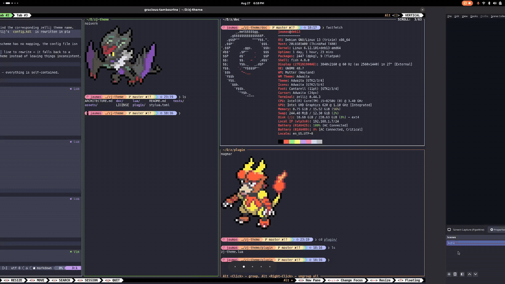

# zj-theme.nvim

[](https://github.com/jaimeibanezrivera/zj-theme/actions/workflows/ci.yml)

Sync your zellij theme — and optionally your terminal emulator's own theme —
to whatever colorscheme is active in neovim.


Two independent channels, each on by default or opt-in:

- **zellij's own theme** — rewrites zellij's config file directly. zellij
  watches that file for changes and applies them to your already-running
  session automatically (zellij polls it roughly once a second), so this
  takes effect live — no restart needed. Requires being inside a zellij
  session.
- **Your terminal emulator's theme** (opt-in — see
  [Bonus: Terminal emulator theming](#bonus-terminal-emulator-theming)) —
  rewrites a small file this plugin owns, which the terminal itself is set
  up to pick up live. Works whether or not you're inside zellij. Only
  terminals that reload their own config live are supported (currently:
  WezTerm, Alacritty).

Requires Neovim >= 0.10 (for the `vim.health.*` API used by `:checkhealth`).
See also `:help zj-theme`.

## How it works (zellij's theme)

1. A `ColorScheme` autocmd fires whenever you run `:colorscheme ...` (or a
   plugin sets one on your behalf).
2. The new `vim.g.colors_name` is looked up in a mapping table (built-in
   defaults + anything you add) to find the corresponding zellij theme name.
3. The `theme "..."` line in zellij's `config.kdl` is rewritten in place with
   that theme name.
4. If any step fails — the colorscheme has no mapping, the config file isn't
   readable, or it has no `theme` line to rewrite — it falls back to a
   configurable default zellij theme instead of leaving things inconsistent.

## Installation

No external plugin dependency needed — everything is self-contained.

### lazy.nvim

```lua
-- For `plugins/zj-theme.lua` users.
return {
  "jaimeibanezrivera/zj-theme",
  lazy = false,
  config = function()
    require("zj-theme").setup({
      -- see Configuration below
    })
  end,
}
```

```lua
-- For `plugins.lua` users.
{
  "jaimeibanezrivera/zj-theme",
  lazy = false,
  config = function()
    require("zj-theme").setup({
      -- see Configuration below
    })
  end,
}
```
### packer.nvim

```lua
use({
  "jaimeibanezrivera/zj-theme",
  config = function()
    require("zj-theme").setup({
      -- see Configuration below
    })
  end,
})
```

### vim-plug

```vim
Plug 'jaimeibanezrivera/zj-theme'
```

Then, elsewhere in your `init.vim`/`init.lua` (vim-plug has no per-plugin
config callback):

```lua
lua require("zj-theme").setup({
  -- see Configuration below
})
```

### mini.deps

```lua
local MiniDeps = require("mini.deps")

MiniDeps.add({ source = "jaimeibanezrivera/zj-theme" })

MiniDeps.now(function()
  require("zj-theme").setup({
    -- see Configuration below
  })
end)
```

### vim.pack (Neovim >= 0.12, built in, no plugin manager needed)

```lua
vim.pack.add({
  "https://github.com/jaimeibanezrivera/zj-theme",
})

require("zj-theme").setup({
  -- see Configuration below
})
```

## Configuration

```lua
require("zj-theme").setup({
  -- zellij's config.kdl.
  zellij_config_path = vim.fn.expand("~/.config/zellij/config.kdl"),

  -- Fallback zellij themes, picked by vim.o.background.
  default_dark_theme = "default",
  default_light_theme = "pencil-light",

  -- nvim colorscheme -> zellij theme. Merged over mappings.lua's defaults.
  -- Value can be { dark = "...", light = "..." } for colorschemes that
  -- don't rename on background (ayu.nvim, gruvbox-material, etc).
  mappings = {
    mycustomtheme = "my-zellij-theme-name",
    myflexibletheme = { dark = "my-dark-zellij-theme", light = "my-light-zellij-theme" },
  },

  -- Terminal emulator sync — see Bonus section below.
  terminal = {},

  -- Silence vim.notify warnings/errors.
  notify = true,
})
```

Your `config.kdl` needs an actual (uncommented) `theme "..."` line already
present for this plugin to find and rewrite — it won't add one from
scratch.

### On the zellij side

Whatever `"my-zellij-theme-name"` you map a colorscheme to in `mappings`
has to actually exist for zellij, or nothing changes color once written.
Two ways to make that true:

- It's one of zellij's [built-in themes](https://zellij.dev/documentation/theme-list) —
  nothing further needed, this is what [Supported colorschemes](#supported-colorschemes)
  below uses.
- It's a theme you've defined yourself, in a `themes { "my-zellij-theme-name" { ... } }`
  block in `config.kdl` (or a separate file in zellij's `theme_dir`) — see zellij's
  [theme documentation](https://zellij.dev/documentation/themes.html) for the format.

This plugin only rewrites the `theme "..."` line; it doesn't check whether
that name resolves to anything on zellij's side. Map to a theme that
doesn't exist (a typo, or one you meant to define but didn't) and zellij
will just silently fail to apply it — nothing will look wrong here, the
line will be written correctly, it just won't do anything.

## Supported colorschemes

Best-effort mappings for these plugins are bundled by default — see
[`lua/zj-theme/mappings.lua`](lua/zj-theme/mappings.lua) for the exact
zellij theme each one resolves to, and override any of them via `mappings`
in `setup()`.

| Plugin | Colorscheme names |
|---|---|
| [catppuccin/nvim](https://github.com/catppuccin/nvim) | `catppuccin`, `catppuccin-mocha`, `catppuccin-macchiato`, `catppuccin-frappe`, `catppuccin-latte` |
| [ellisonleao/gruvbox.nvim](https://github.com/ellisonleao/gruvbox.nvim) | `gruvbox` |
| [sainnhe/gruvbox-material](https://github.com/sainnhe/gruvbox-material) | `gruvbox-material` |
| [folke/tokyonight.nvim](https://github.com/folke/tokyonight.nvim) | `tokyonight`, `tokyonight-night`, `tokyonight-storm`, `tokyonight-moon`, `tokyonight-day` |
| [EdenEast/nightfox.nvim](https://github.com/EdenEast/nightfox.nvim) | `nightfox`, `dayfox`, `carbonfox` |
| [Shatur/neovim-ayu](https://github.com/Shatur/neovim-ayu) | `ayu` (`ayu-dark`/`ayu-light`/`ayu-mirage` are also mapped, for other ayu-family plugins that set those names directly) |
| [maxmx03/solarized.nvim](https://github.com/maxmx03/solarized.nvim) | `solarized` |
| [lifepillar/vim-solarized8](https://github.com/lifepillar/vim-solarized8) | `solarized8`, `solarized8_flat`, `solarized8_high`, `solarized8_low` |
| [navarasu/onedark.nvim](https://github.com/navarasu/onedark.nvim) | `onedark` |
| [sonph/onehalf](https://github.com/sonph/onehalf) | `onehalfdark` (`onehalflight` has no zellij light-theme equivalent) |
| [gbprod/nord.nvim](https://github.com/gbprod/nord.nvim) | `nord` |
| [Mofiqul/dracula.nvim](https://github.com/Mofiqul/dracula.nvim) | `dracula` |
| [rebelot/kanagawa.nvim](https://github.com/rebelot/kanagawa.nvim) | `kanagawa` |
| [neanias/everforest-nvim](https://github.com/neanias/everforest-nvim) | `everforest` |
| [NLKNguyen/papercolor-theme](https://github.com/NLKNguyen/papercolor-theme) | `PaperColor` |

Using something else? Add it via `mappings` in `setup()`.

## Fallback behavior

`default_dark_theme` or `default_light_theme` (chosen by `vim.o.background`)
is used whenever nvim is not running inside a zellij session (`$ZELLIJ`
unset, in which case nothing is written at all), the active colorscheme
has no entry in `mappings`, or `zellij_config_path` doesn't exist/isn't
readable, or has no `theme "..."` line to rewrite.

## Bonus: Terminal emulator theming

Also keep your terminal emulator's own palette in sync with both nvim and zellij.
Off by default — set `terminal.emulator` to turn it on. Supported: WezTerm, Alacritty.
Recommended for a more coherent, better-looking experience across the board.



### Alacritty

```lua
require("zj-theme").setup({
  -- ...rest of config from above...
  terminal = { emulator = "alacritty" },
})
```

This plugin writes `terminal.config_path` (defaults to
`~/.config/alacritty/zj-theme.toml`), containing a `general.import`
pointing at `<terminal.themes_dir>/<theme>.toml`. Alacritty ships no
built-in named themes of its own, so theme names are resolved as files in
[alacritty/alacritty-theme](https://github.com/alacritty/alacritty-theme)'s
`themes/` folder — clone it to `terminal.themes_dir` (defaults to
`~/.config/alacritty/themes`):

```sh
git clone --depth 1 https://github.com/alacritty/alacritty-theme \
  ~/.config/alacritty/alacritty-theme
ln -s ~/.config/alacritty/alacritty-theme/themes ~/.config/alacritty/themes
```

In your real `~/.config/alacritty/alacritty.toml`:

```toml
[general]
import = ["~/.config/alacritty/zj-theme.toml"]
```

Alacritty resolves `import` recursively and live-reloads on file change by
default, so this takes effect without a restart.

### WezTerm

```lua
require("zj-theme").setup({
  -- ...rest of config from above...
  terminal = { emulator = "wezterm" },
})
```

This plugin writes `terminal.config_path` (defaults to
`~/.config/wezterm/zj-theme.lua`), containing `return "<scheme name>"`. In
your real `~/.config/wezterm/wezterm.lua`:

```lua
local wezterm = require("wezterm")
local config = wezterm.config_builder()

config.color_scheme = require("zj-theme") -- reads the managed file above

-- wezterm only watches wezterm.lua by default — watch the managed file too.
wezterm.add_to_config_reload_watch_list(wezterm.config_dir .. "/zj-theme.lua")

return config
```

Theme names are resolved to one of WezTerm's ~700 bundled color schemes —
nothing to install on the WezTerm side.

### All terminal options

```lua
require("zj-theme").setup({
  -- ...rest of config from above...

  terminal = {
    emulator = nil, -- "wezterm" | "alacritty"

    -- nil uses the emulator's standard config dir.
    config_path = nil,

    -- alacritty only. nil defaults to ~/.config/alacritty/themes.
    themes_dir = nil,

    -- Same shape as `mappings` above, for the terminal instead of zellij.
    mappings = {
      mycustomtheme = "My Custom Scheme",
    },

    -- Fallback themes. nil uses the emulator's own default.
    default_dark_theme = nil,
    default_light_theme = nil,
  },
})
```

Colorscheme names map to each adapter's own theme names — see
[`lua/zj-theme/terminals/wezterm.lua`](lua/zj-theme/terminals/wezterm.lua)
and [`lua/zj-theme/terminals/alacritty.lua`](lua/zj-theme/terminals/alacritty.lua)
for the exact tables, and override any of them via `terminal.mappings`.

`terminal.default_dark_theme` or `terminal.default_light_theme` is used
whenever the active colorscheme has no entry in `terminal.mappings`, or
writing `terminal.config_path` fails (e.g. its directory doesn't exist).
Nothing is written at all if `terminal.emulator` is unset.

## Health

Run `:checkhealth zj-theme` to check whether `setup()` has been called,
whether you're currently inside a zellij session, whether
`zellij_config_path` exists and has a `theme "..."` line, whether the
active colorscheme is mapped for zellij, and — if `terminal.emulator` is
set — whether it names a supported adapter, whether `terminal.config_path`
is set and its directory is writable, and whether the active colorscheme
is mapped for that terminal too.

## Recommended plugins

- **[zellij-nav.nvim](https://github.com/swaits/zellij-nav.nvim)** — seamless
  navigation between nvim splits and zellij panes, so the same keys move
  focus across both. Complements this plugin: that one syncs navigation,
  this one syncs the theme.

## Contributing

Want to dig into the code or send a PR? See
[ARCHITECTURE.md](ARCHITECTURE.md) for a developer-facing walkthrough of
how the plugin is put together — the module breakdown, the event/data flow
through `setup()` and `apply_all()`, and diagrams for each of the two sync
mechanisms (zellij's own theme, the terminal emulator's own theme).

## License

MIT, see [LICENSE](LICENSE).
